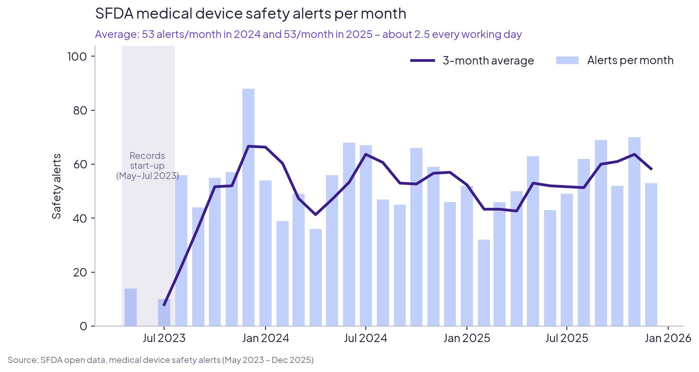
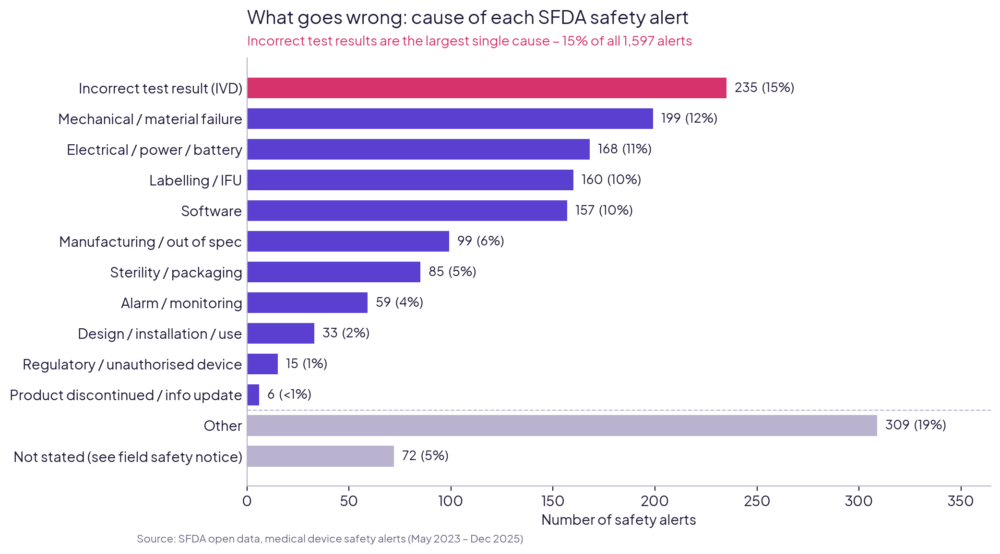
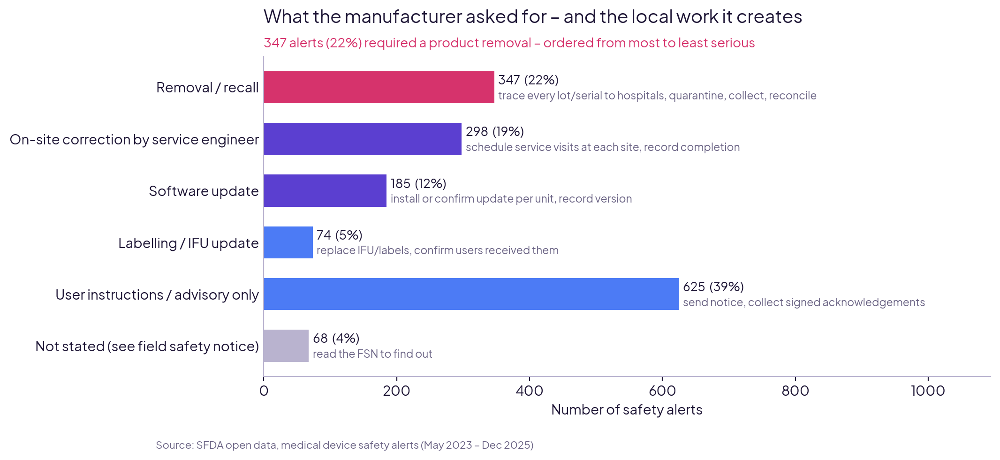
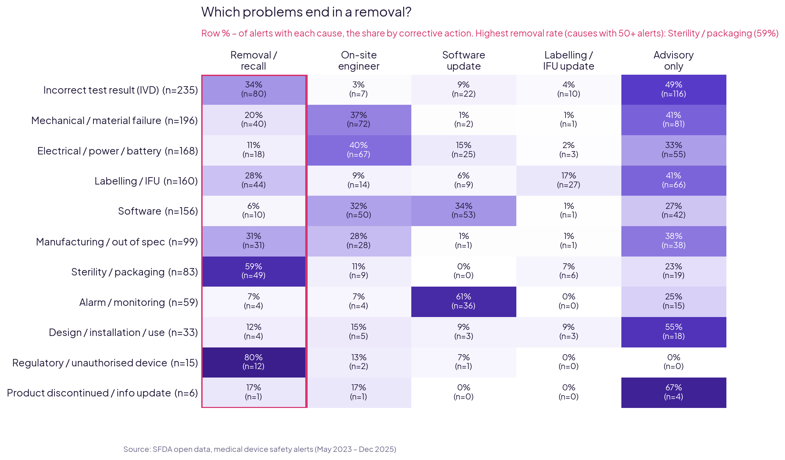
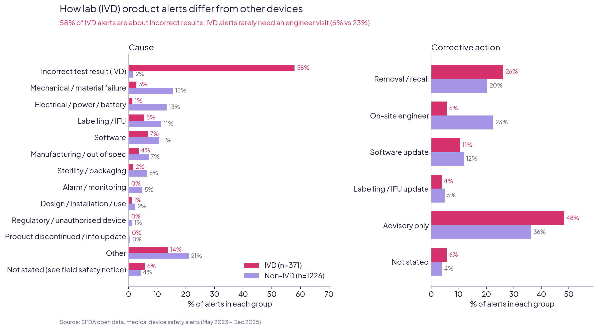
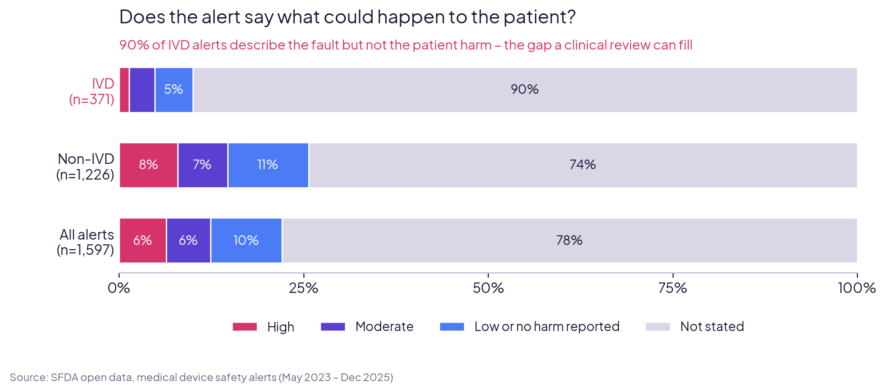
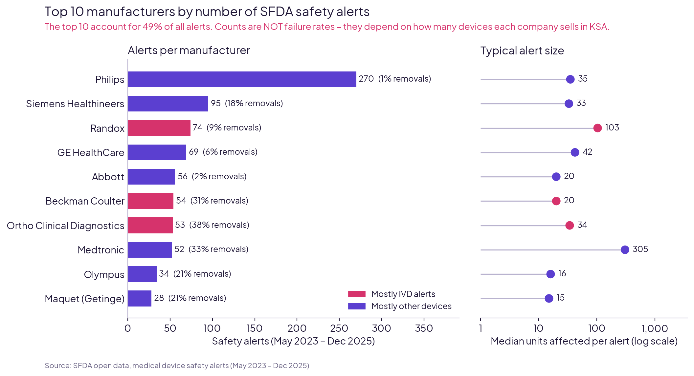
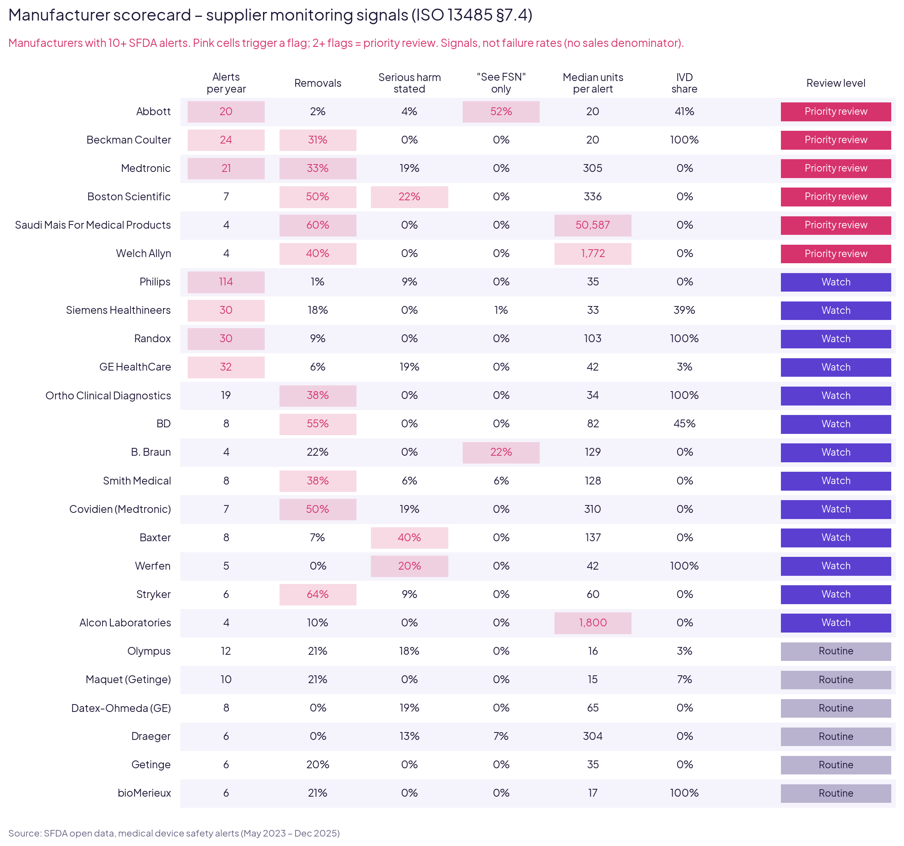

# Case Study 2 – Saudi Medical Device Safety Alerts (SFDA)

**What 1,597 SFDA safety alerts (May 2023 – Dec 2025) mean for the distributors and quality teams who have to act on them.**

*Dr. Muhammad Ali, DPT · Medical Researcher and Data Analytics*

---

## The question

What goes wrong with medical devices on the Saudi market, what local work does each alert create, and which suppliers need closer monitoring?

**Built for:** medical device distributors, authorised representatives, and QA / regulatory teams.

## Key findings

| # | Finding | What it means for a QA / PMS team |
|---|---|---|
| 1 | **About 53 alerts a month** (2–3 every working day); **57%** need a physical or product change | Alert screening is a daily task. Each alert needs a logged decision and an SFDA deadline. |
| 2 | **22% end in a product removal** | Lot-to-hospital traceability records must be ready (SFDA MDS-REQ 9). |
| 3 | **Wrong lab results are the largest single cause** (15% of all alerts, 58% of lab/IVD alerts). Lab alerts rarely need an engineer (6% vs 23%) | For lab products, PMS work is lot tracing and lab follow-up, not field service. |
| 4 | **90% of lab/IVD alerts don't say what the error could mean for the patient** (74% for other devices) | Someone with clinical knowledge has to judge the patient risk and set the priority. |
| 5 | **Volume is not risk**: Philips has the most alerts (270) but only 1% end in removal; **6 of 25** major manufacturers trigger 2+ monitoring flags | A supplier scorecard gives evidence for supplier monitoring (ISO 13485 §7.4) and management review (§5.6). |

## Charts

## How it was done

1. **Collect:** SFDA open data, 1,597 safety alerts, no missing values.
2. **Clean:** text artefacts removed; 538 manufacturer name spellings combined into 339.
3. **Code and check:** each alert coded for cause, corrective action, lab (IVD) or not, and stated harm, using keyword rules. Every rule was spot-checked by hand and 141 coding errors were fixed.
4. **Analyse:** 8 charts and a supplier scorecard with 5 monitoring flags.

## Files

| Folder | Contents |
|---|---|
| [`notebooks/`](notebooks) | `cs2_01_clean.ipynb` (cleaning) · `cs2_02_analysis.ipynb` (coding, charts, scorecard) |
| [`figures/`](figures) | All charts as PNG |
| [`data/`](data) | `alerts_coded.csv` (all alerts with codes) · `manufacturer_scorecard.csv` |

**Tools:** Python (pandas, matplotlib) in Google Colab.

## Limitations

- **Counts, not failure rates.** SFDA doesn't publish sales or installed-base data, so more alerts can simply mean more devices on the market.
- **24% of causes couldn't be coded** from the alert text.
- **Codes come from keyword rules checked by hand**, not a validated coding system (e.g. IMDRF terms).
- **The harm grade reflects what manufacturers wrote**, not a clinical risk assessment (ISO 14971).

## Data source

Saudi Food and Drug Authority (SFDA), *Safety Alerts Data for Medical Devices*, published on the Saudi Open Data portal: [open.data.gov.sa](https://open.data.gov.sa).

---

**Contact:** muhammadali17598@gmail.com · +966 57 087 8136
